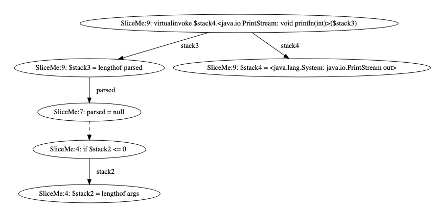

# Slicer4J

[](https://github.com/resess/Slicer4J/actions/workflows/maven.yml)
[](https://github.com/resess/Slicer4J/actions/workflows/maven_test.yml)


This repository hosts Slicer4J, an accurate, low-overhead dynamic slicer for Java programs. 
Slicer4J automatically generates a backward dynamic slice from a user selected executed statement and variables used in the statement (slicing criterion). 
Slicer4J relies on soot which currently supports instrumenting programs compiled with up to Java 9. 
Contributions to this repo are most welcome!


<b>If you use this tool, please cite:</b>

Khaled Ahmed, Mieszko Lis, and Julia Rubin. [Slicer4J: A Dynamic Slicer for Java](https://people.ece.ubc.ca/mjulia/publications/Slicer4J_2021.pdf). The ACM Joint European Software Engineering Conference and Symposium on the Foundations of Software Engineering (ESEC/FSE), 2021. [\<bibtex>](slicer4j.bib)


<b>Also, please check out our [video demonstration](https://youtu.be/mn7z6I-WyH4) of Slicer4J </b>


## Table of Contents
1. [Requirements](#Requirements)
2. [Building the Tool](#Building-the-Tool)
3. [Using the Tool](#Using-the-Tool)
4. [Inspecting the Output](#Inspecting-the-Output)
5. [Evaluation Benchmarks](#Evaluation-Benchmarks)

---
---

## Requirements

* Runs on Windows, Linux, and Mac OS

* Install python3

    * Linux: https://docs.python-guide.org/starting/install3/linux/
    * Mac: https://docs.python-guide.org/starting/install3/osx/
    * Windows: https://docs.python.org/3/using/windows.html

* Clone the dynamic slicing core: https://github.com/resess/DynamicSlicingCore


* Requires Java Runtime Environment version 9 or above. 

---
---

## Building the Tool

Build and install the dynamic slicing core, go to the core's repo: (https://github.com/resess/DynamicSlicingCore)

```bash
cd core/
mvn -Dmaven.test.skip=true clean install
cd -
```


Build Slicer4J, go back to Slicer4J's repo
```bash
cd Slicer4J/
mvn -Dmaven.test.skip=true clean install
cd -
```

---
---

## Using the Tool


Display the command line parameters using:
```
java -cp "Slicer4J/target/slicer4j-jar-with-dependencies.jar:Slicer4J/target/lib/*" ca.ubc.ece.resess.slicer.dynamic.slicer4j.Slicer -h
```
A simpler method to use Slicer4J is by using the wrapper python script: `scripts/slicer4j.py`

You can list the script parameters using: `python3 slicer4j.py -h`


Slicer4J uses up to 8GB of RAM. The tool will crash with `OutOfMemoryError` exception if the trace size is greater than 8GB.
In that case, you can [change maximum heap size](https://docs.oracle.com/cd/E21764_01/web.1111/e13814/jvm_tuning.htm#PERFM161) allocated to Slicer4J by changing the -Xmx8g to a higher value (e.g. -Xmx16g).

---

### Slicer4J Mandatory Command Line Parameters: 


<table class="tg">
<thead>
  <tr>
    <th class="tg-73oq">Parameter<br></th>
    <th class="tg-73oq">Description</th>
  </tr>
</thead>
<tbody>
  <tr>
    <td class="tg-73oq">-h</td>
    <td class="tg-73oq">show help message and exit</td>
  </tr>
  <tr>
    <td class="tg-73oq">-j</td>
    <td class="tg-73oq">Path to jar file</td>
  </tr>
  <tr>
    <td class="tg-73oq">-o</td>
    <td class="tg-73oq">Output folder</td>
  </tr>
  <tr>
    <td class="tg-73oq">-b</td>
    <td class="tg-73oq">line to slice backward from, in the form of FileName:LineNumber </td>
  </tr>
</tbody>
</table>

<br>

---

### Slicer4J Optional Command Line Parameters: 


<table class="tg">
<thead>
  <tr>
    <th class="tg-73oq">Parameter<br></th>
    <th class="tg-73oq">Description</th>
  </tr>
</thead>
<tbody>
  <tr>
    <td class="tg-73oq">-m</td>
    <td class="tg-73oq">Main class to run with arguments, in the form of "FileName Arguments"</td>
  </tr>
  <tr>
    <td class="tg-73oq">-tc</td>
    <td class="tg-73oq">Test class name to run, if this is provided, -tm must also be provided</td>
  </tr>
  <tr>
    <td class="tg-73oq">-tm</td>
    <td class="tg-73oq">Test method to run</td>
  </tr>
  <tr>
    <td class="tg-73oq">-dep</td>
    <td class="tg-73oq">Directory to folder containing JAR dependencies, if any</td>
  </tr>
  <tr>
    <td class="tg-0lax">-mod</td>
    <td class="tg-0lax">Folder containing user-defined method models</td>
  </tr>
  <tr>
    <td class="tg-0lax">-d</td>
    <td class="tg-0lax">Slice with data-flow dependencies only</td>
  </tr>
  <tr>
    <td class="tg-0lax">-c</td>
    <td class="tg-0lax">Slice with control dependencies only</td>
  </tr>
  <tr>
    <td class="tg-0lax">-once</td>
    <td class="tg-0lax">Get only the immediate data-flow and control dependencies of the slicing criteria</td>
  </tr>
</tbody>
</table>

<br>

---

### User-defined method models: 

The following is an example for defining your own method models. 

For the methods in this class:
```Java
package com.myproject;
class MyClass extends MyOtherClass{
    String field;
    public MyClass put(String val){
        this.field = val;
    }
    public String get(){
        return this.field;
    }
}
```

create an XML file named "com.myproject.MyClass.xml" and place it in a folder containing your method models, this is the folder we pass to Slicer4J using the `-mod` parameter

For example, here's the model for the above class
```xml
<?xml version="1.0" ?>
<summary fileFormatVersion="101">
<hierarchy superClass="com.myproject.MyOtherClass" />
  <methods>
    <method id="com.myproject.MyClass put(java.lang.String)">
      <flows>
        <flow>
          <from sourceSinkType="Parameter" ParameterIndex="0" />
          <to sourceSinkType="Field" AccessPath="[com.myproject.MyClass: java.lang.String field]"
          	AccessPathTypes="java.lang.String" />
        </flow>
        <flow>
          <from sourceSinkType="Field" />
          <to sourceSinkType="Return" />
        </flow>
      </flows>
    </method>
    <method id="java.lang.String get()">
      <flows>
        <flow>
          <from sourceSinkType="Field" AccessPath="[java.nio.CharBuffer: char[] buffer]"
          	AccessPathTypes="[char[]]" />
           <to sourceSinkType="Return" />
        </flow>
      </flows>
    </method>
</summary>
```

The `id` of each method is the method signature. Each method has flows `from` parameters, the receiver, and their fields, `to` other parameters, the receiver, their fields, and the return.


Each flow is specified with it `sourceSinkType` as `Parameter`, `Field`, or `Return`.
`Parameter` is used for parameters. `Field` is used for the receiver or fields of the receiver. `Return` is for the method return.
For parameters, we also need `ParameterIndex` to specify which parameter (first, second, etc.).
For fields, we specify the signature of the field in `AccessPath` and its type in `AccessPathTypes`.

---
---
## Inspecting the Output:

You can view the output of Slicer4J in 3 different formats: [Source Map](#Source-Map), [Raw Slice](#Raw-Slice), and [#Graph](Graph).

Let's see the output of slicing the `SliceMe` program (found under `benchmarks/SliceMe`): 

```Java
 1. public class SliceMe {
 2.    public static void main(String[] args) {
 3.        int [] parsed;
 4.        if (args.length > 0){
 5.            parsed = parse(args);
 6.        } else {
 7.            parsed = null;
 8.        }
 9.        System.out.println(parsed.length);
10.    }
11.    private static int[] parse(String[] str) {
12.        String fullString = String.join(", ", str);
13.        int [] arr = new int[fullString.length()];
14.        for (int i = 0; i< fullString.length(); i++) {
15.          arr[i] = fullString.charAt(i)-'0';
16.        }
17.        return arr;
18.    }
20. }
```
If we run this program using `java -jar sliceme-1.0.0.jar SliceMe` without providing any arguments to the main method)

```bash
cd scripts
python3 slicer4j.py -j ../benchmarks/SliceMe/target/sliceme-1.0.0.jar -o sliceme_slice/ -b SliceMe:9 -m "SliceMe"
```

In this example, we slice from line 9 in the `SliceMe.java` file: `System.out.println(parsed.length);`

---


### Source Map:
This output is only generated if the JAR is compiled with debug information.
Slicer4J outputs a list of `files-name: source-code-line-number` for each statement that compose the slice. 
This output is stored in the output folder in a file called `slice.log`

For the example, `slice.log` contains:
```
SliceMe:4
SliceMe:7
SliceMe:9
```
Which indicates that the slice is: 
```Java
 4.        if (args.length > 0){
 7.            parsed = null;
 9.        System.out.println(parsed.length);
```

---
### Raw Slice:

Slicer4J outputs a list of Jimple statements with a unique Id for each statement, which we use as our intermediate format, together with the thread id of the thread they are execute in, with the source map of file and line numbers for jars that are compiled with debug information.

Every element in the list is in the format `files-name: source-code-line-number   thread    statement-id:jimple-statement`

This output is stored in the output folder in a file called `raw-slice.log`

For the example, `raw-slice.log` contains:

```
SliceMe:4    1    0:$stack2 = lengthof args
SliceMe:4    1    1:if $stack2 <= 0 goto parsed = null
SliceMe:7    1    2:parsed = null
SliceMe:9    1    3:$stack4 = <java.lang.System: java.io.PrintStream out>
SliceMe:9    1    4:$stack3 = lengthof parsed
SliceMe:9    1    5:virtualinvoke $stack4.<java.io.PrintStream: void println(int)>($stack3)
```
Here we see that all statements are within the same thread (thread #1), and we see how each line is represented in Jimple (`if (args.length > 0)` in the code maps to `$stack2 = lengthof args` and `if $stack2 <= 0 goto parsed = null` in Jimple)

---
### Graph:

Slicer4J outputs a [dot graph](https://graphviz.org/doc/info/lang.html)  whose nodes are statements in the slice and edges are data and control dependencies between the statements. 

This output is stored in the output folder in a file called `slice-graph.pdf`


For the example, `slice-graph.pdf` contents is shown here:



Here we see the control dependencies (dashed edges) and data flow-dependencies (solid edges) between the Jimple statements from the raw slice.

For example, `$stack3 = lengthof parsed` is data-flow dependent on `parsed = null` through the variable `parsed`, which is written on the edge. 
Also, `parsed = null` is control dependent on `if $stack2 <= 0 goto parsed = null`.

---
---
## Evaluation Benchmarks

The evaluation benchmarks are stored under [benchmarks](benchmarks/README.md), please check there for instructions on how to run them.

---
---
# Contact

If you experience any issues, please submit an issue or contact us at khaledea@ece.ubc.ca
